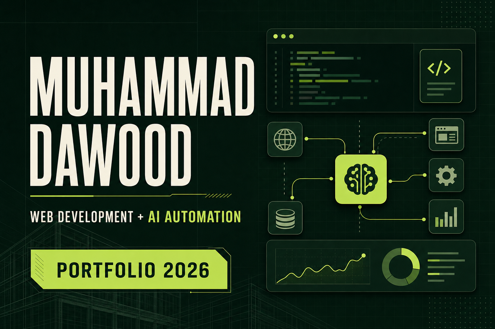

# Muhammad Dawood - Web Development & AI Automation Portfolio

[](https://muhammad-dawood-portfolio.vercel.app)
[](https://github.com/davimiza1)
[](https://linkedin.com/in/muhammad-dawood-03b307274)



A production portfolio for **Muhammad Dawood**, a web developer, WordPress engineer, and AI automation specialist. The site presents working SaaS products, CRM automation, original WordPress engineering, commercial client experience, and a downloadable professional CV.

## Live portfolio

**Production:** [muhammad-dawood-portfolio.vercel.app](https://muhammad-dawood-portfolio.vercel.app)

The production project is connected to this repository. Updates pushed to `main` can be deployed through Vercel.

## Portfolio highlights

- Strong editorial design with a distinctive forest-green and lime visual system
- Responsive layouts for desktop, tablet, and mobile screens
- Four detailed software and automation case studies
- Dedicated WordPress engineering and client-work section
- Professional experience and technical-capability overview
- Direct email, GitHub, LinkedIn, and live-project links
- Downloadable two-page Web & AI Automation CV
- Custom Open Graph artwork for professional link sharing
- Accessible navigation and semantic page structure

## Featured projects

| Project | What it demonstrates | Live | Source |
| --- | --- | --- | --- |
| **LeadIQ AI** | Supabase authentication, persistent user-scoped leads, explainable scoring, analytics, and validated CSV import | [Open app](https://leadiq-ai-xtiz-pearl.vercel.app) | [Repository](https://github.com/davimiza1/leadiq-ai) |
| **AI Lead Qualification** | HMAC-verified webhooks, schema validation, GoHighLevel synchronization, idempotency, audit logs, Docker, and CI | - | [Repository](https://github.com/davimiza1/ai-lead-qualification-ghl) |
| **SupportPilot AI** | Ticket workflows, AI-assisted drafts, customer context, notes, responsive product UI, and server-backed demo actions | [Open app](https://supportpilot-ai-chi.vercel.app) | [Repository](https://github.com/davimiza1/supportpilot-ai) |
| **CommercePulse** | Interactive e-commerce reporting, product filters, inventory alerts, charts, order search, and responsive dark mode | [Open app](https://commerce-pulse.vercel.app) | [Repository](https://github.com/davimiza1/commerce-pulse) |

## WordPress and client work

The portfolio also presents:

- **Home Seekers Real Estate** - Elementor layouts, property fields, CRM inquiry architecture, and performance work
- **Himalayas Overseas Education** - destination-led information architecture, lead capture, and on-page SEO
- **WordPress CRM Lead Connector** - original PHP plugin with signed requests, safe webhook delivery, retry handling, and private logs
- **Elevate Business Pro** - original hybrid WordPress theme supporting Elementor, Gutenberg patterns, design controls, and accessible navigation

## Technology

### Application

- Next.js 16
- React 19
- TypeScript
- Custom responsive CSS
- Geist and Geist Mono typography

### Delivery

- Git and GitHub
- Vercel production hosting
- Cloudflare-compatible Vinext/Vite build
- Automated production and link-verification tests

## Project structure

```text
app/
  globals.css        Portfolio design system and responsive styles
  layout.tsx         Metadata, fonts, Open Graph, and X sharing setup
  page.tsx           Portfolio content and interactive mobile navigation
public/
  og.png             Custom social-sharing card
  muhammad-dawood-cv.pdf
tests/
  rendered-html.test.mjs
vercel.json          Native Next.js production configuration
```

## Run locally

Requirements: Node.js `22.13.0` or newer.

```bash
git clone https://github.com/davimiza1/muhammad-dawood-portfolio.git
cd muhammad-dawood-portfolio
npm install
npm run dev
```

Open `http://localhost:3000` in your browser.

## Validate

Cloudflare-compatible build and rendered-content tests:

```bash
npm test
```

Native Vercel/Next.js production build:

```bash
npx next build
```

## Contact

- **Email:** [muhammad.dawood1006@gmail.com](mailto:muhammad.dawood1006@gmail.com)
- **GitHub:** [github.com/davimiza1](https://github.com/davimiza1)
- **LinkedIn:** [Muhammad Dawood](https://linkedin.com/in/muhammad-dawood-03b307274)

---

Designed and developed by **Muhammad Dawood**.
